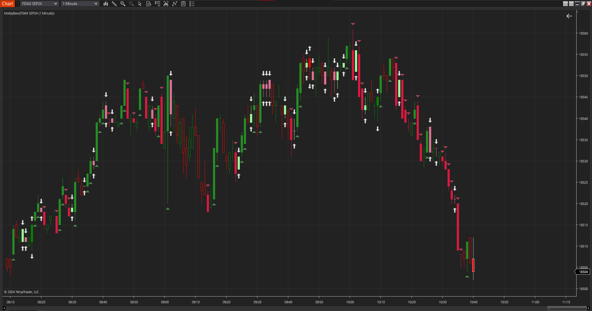
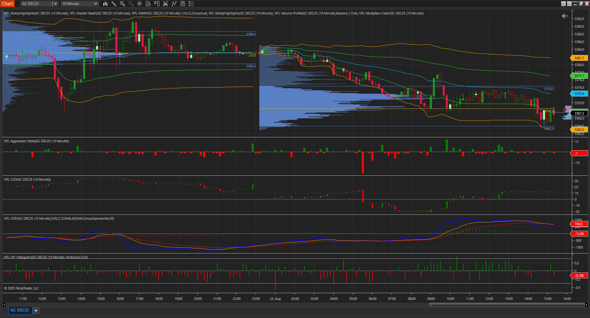

# NTLambda - NinjaTrader 8 Indicators

A comprehensive collection of professional order flow analysis indicators for NinjaTrader 8, providing traders with advanced order flow tools including volume profile, cumulative delta, VWAP, market depth visualization, and sophisticated order flow analysis suite.

## Features

### Core Indicators
- **CVD (Cumulative Volume Delta)** - Real-time cumulative delta with candlestick visualization and customizable reset periods
- **VWAP** - Volume Weighted Average Price with standard deviation bands
- **Volume Profile** - Session-based volume profile with Value Area, POC, and buy/sell analysis
- **Aggression Delta** - Real-time order flow delta showing market aggression
- **Market Depth** - Live order book visualization with customizable depth display
- **MoldyBars** - Advanced candlestick analysis with volume and order flow integration
- **MoldyBars Clean** - Streamlined version of MoldyBars with essential features
- **MoldyHighlights** - Price action highlighting based on volume and order flow patterns
- **COFI (Cumulative Order Flow Imbalance)** - Order flow imbalance tracking with weighting options
- **OFI Histogram** - Order Flow Imbalance histogram visualization with threshold levels
- **TPO Overlay** - Time Price Opportunity overlay

### OrderFlowKit - Advanced Order Flow Analysis Suite
- **Bookmap** - Level 2 depth of market visualization with heat mapping, aggressive order detection, real-time session recording, and replay capabilities
- **Order Flow** - Complete footprint/cluster chart analysis with bid/ask breakdown, POC/POI detection, and multiple visualization styles
- **Volume Analysis Profile** - Interactive volume profile with drag-and-drop functionality, multiple formulas, and POC/POI identification
- **Volume Filter** - Advanced volume filtering tool for detecting significant volume areas with customizable geometry and thresholds
- **Market Volume** - Comprehensive volume analysis with multiple formulas, cumulative periods, and delta calculations
- **Wyckoff Render** - Wyckoff method-based market analysis visualization
- **SE (Smart Engine)** - Advanced market analysis engine

### Chart Styles
- **Simple High Low Chart** - Streamlined high-low visualization

### Drawing Tools
- **Anchored VWAP** - Manual anchored VWAP with deviation bands
- **Range Volume Profile** - Manual range-based volume profile analysis

### TradingView Scripts
- **Linus-Sammlung** - Collection of TradingView Pine Script utilities and indicators
- **MoldyMoves** - Price action analysis scripts for TradingView platform

## Screenshots




## Installation

### NTLambda Core Indicators
1. Download the latest code
2. Copy the directories to your NinjaTrader 8 installation directory:
   - **Indicators**: `Documents\NinjaTrader 8\bin\Custom\Indicators\NTLambda\`
   - **DrawingTools**: `Documents\NinjaTrader 8\bin\Custom\DrawingTools\NTLambda\`
   - **ChartStyles**: `Documents\NinjaTrader 8\bin\Custom\ChartStyles\NTLambda\`
3. Restart NinjaTrader 8
4. Find the indicators under "NTLambda" category

### OrderFlowKit Installation
1. Copy AddOns files from `NT8\OrderFlowKit\AddOns\` to `Documents\NinjaTrader 8\bin\Custom\AddOns\`
2. Copy indicator files (`Bookmap.cs`, `MarketVolume.cs`, `OrderFlow.cs`, `VolumeAnalysisProfile.cs`, `VolumeFilter.cs`) to `Documents\NinjaTrader 8\bin\Custom\Indicators\`
3. Enable Tick Replay:
   - Go to **Tools → Options → Market Data**
   - Check "Show Tick Replay"
   - For each chart: **New → Chart → [Instrument]** and enable "Tick Replay"
4. Restart NinjaTrader 8

## Requirements

- **NinjaTrader 8** (Latest version recommended)
- **Market Data**: Real-time Level II data required for OrderFlowKit functionality
- **Chart Types**: Works best with tick-based or minute-based charts
- **Tick Replay**: Required for OrderFlowKit indicators (must be enabled in Market Data settings)
- **Data Feed**: High-quality futures data feed recommended for accurate order flow analysis

## Indicator Details

### CVD (Cumulative Volume Delta)
- **Purpose**: Tracks cumulative buying vs selling pressure
- **Features**: Candlestick visualization, multiple reset periods (Daily/Weekly/Session/None)
- **Best For**: Trend confirmation, divergence analysis

### VWAP with Standard Deviation Bands
- **Purpose**: Volume-weighted price levels with statistical bands
- **Features**: Multiple price sources (HLC3, OHLC4, etc.), configurable deviation multipliers
- **Best For**: Support/resistance levels, mean reversion strategies

### Volume Profile
- **Purpose**: Price-volume distribution analysis
- **Features**: Value Area calculation, POC identification, buy/sell breakdown
- **Best For**: Key level identification, market structure analysis

### Market Depth
- **Purpose**: Real-time order book visualization
- **Features**: Bid/ask size display, customizable opacity and width
- **Best For**: Short-term scalping, order flow analysis

## OrderFlowKit - Advanced Analysis Suite

### Bookmap
- **Purpose**: Level 2 market depth visualization with sophisticated heat mapping
- **Key Features**:
  - Real-time depth of market (DOM/Level 2) visualization
  - Heat map for detecting capital injections and aggressive orders
  - Order book showing price distribution with total volume
  - Aggressive market orders and big pending orders filtering
  - Real-time session recording and replay (.db files)
  - Customizable ladder range and market calculations
- **Best For**: Detecting market manipulation, HFT analysis, order flow precision

### Order Flow (Footprint/Cluster Chart)
- **Purpose**: Complete order flow analysis showing supply/demand at each price level
- **Key Features**:
  - Multiple formulas: Bid/Ask, Total Delta, Total, Delta
  - Visualization styles: Profile, Heatmap
  - POC (Point of Control) and POI (Point of Imbalance) detection
  - Volume and percentage representation modes
  - Cluster analysis with customizable positioning
- **Best For**: Identifying resistance/support levels, order flow imbalances

### Volume Analysis Profile
- **Purpose**: Interactive horizontal volume distribution analysis
- **Key Features**:
  - Drag-and-drop functionality for custom range selection
  - Multiple formulas: Total, Delta, BidAsk, combinations
  - Time periods: Days, Minutes, Hours
  - POC and POI identification
  - Interactive zone creation (CTRL+drag) and deletion (SHIFT+click)
- **Best For**: Key level identification, volume-based trading decisions

### Volume Filter
- **Purpose**: Advanced volume detection and filtering system
- **Key Features**:
  - Minimum volume filtering with customizable thresholds
  - Geometry options: Circle, Rectangle with fill/no-fill
  - Formulas: Delta, Total volume calculations
  - Aggressive level sizing for volume zone visualization
  - Perfect complement to Bookmap analysis
- **Best For**: Significant volume detection, battle zone identification

### Market Volume
- **Purpose**: Comprehensive volume analysis with flexible time periods
- **Key Features**:
  - Multiple formulas: BidAsk, Delta, Total, TotalBidAsk, TotalDelta
  - Cumulative period settings for volume aggregation
  - Zero line color coding for market sentiment
  - Real-time delta and accumulated volume tracking
- **Best For**: Volume trend analysis, cumulative pressure tracking

## TradingView Scripts

### Linus-Sammlung
A comprehensive collection of Pine Script utilities and indicators designed for TradingView platform analysis. Includes various technical analysis tools and custom indicators for enhanced market analysis.

### MoldyMoves  
Specialized price action analysis scripts for TradingView, focusing on advanced candlestick patterns and movement detection algorithms.

## Configuration

Each indicator includes comprehensive parameter settings:

- **Visual Settings**: Colors, opacity, line styles
- **Calculation Parameters**: Periods, multipliers, data sources
- **Display Options**: Show/hide components, text labels
- **OrderFlowKit Specific**: Heat map intensity, volume thresholds, session recording options

## Development

### Project Structure
```
NTLambda/
├── NT8/
│   ├── Indicators/NTLambda/     # Core indicators (CVD, VWAP, Volume Profile, etc.)
│   ├── DrawingTools/NTLambda/   # Chart drawing tools (Anchored VWAP, Range VP)
│   ├── ChartStyles/NTLambda/    # Custom chart styles (High-Low, TPO (not working yet))
│   └── OrderFlowKit/            # Advanced order flow analysis suite
│       ├── AddOns/              # SE.cs, WyckoffRender.cs
│       ├── Bookmap.cs           # Level 2 market depth with heat mapping
│       ├── OrderFlow.cs         # Footprint/cluster chart analysis
│       ├── VolumeAnalysisProfile.cs  # Interactive volume profile
│       ├── VolumeFilter.cs      # Volume filtering and detection
│       ├── MarketVolume.cs      # Comprehensive volume analysis
│       └── README.md            # OrderFlowKit documentation
├── TV/                          # TradingView Pine Script collection
│   ├── Linus-Sammlung.py        # Utility indicators
│   └── MoldyMoves.py            # Price action analysis
└── media/                       # Screenshots and documentation
```

## Contributing

Contributions are welcome! Please:
1. Fork the repository
2. Create a feature branch
3. Commit your changes
4. Submit a pull request

## License

This project is licensed under the MIT License - see the [LICENSE.txt](LICENSE.txt) file for details.

## Disclaimer

These indicators are for educational and analysis purposes only. Trading involves risk, and past performance does not guarantee future results. Always practice proper risk management.

---

*NTLambda - Advanced order flow analysis for NinjaTrader 8*
