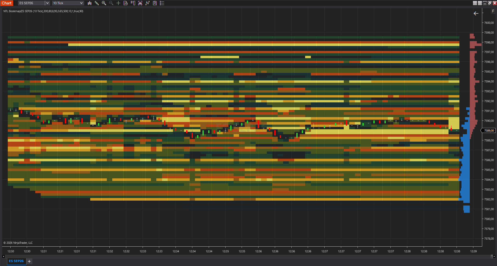
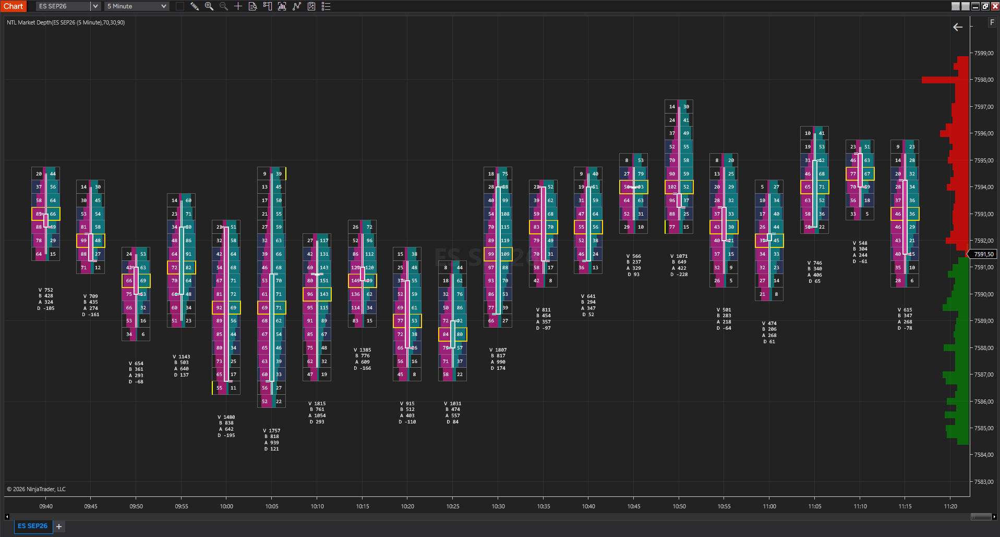
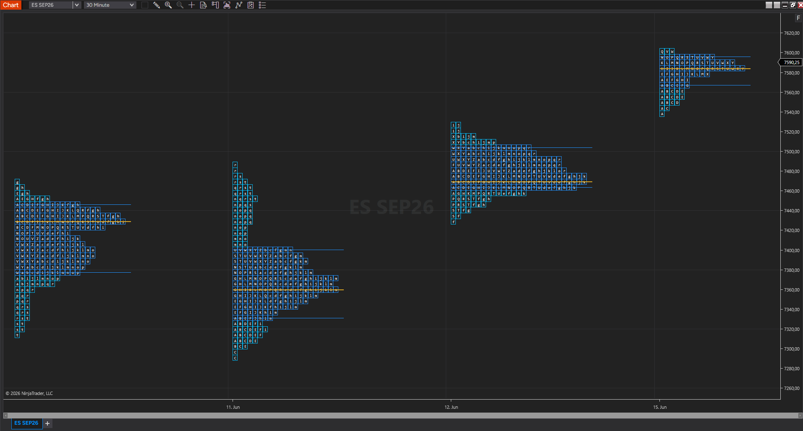
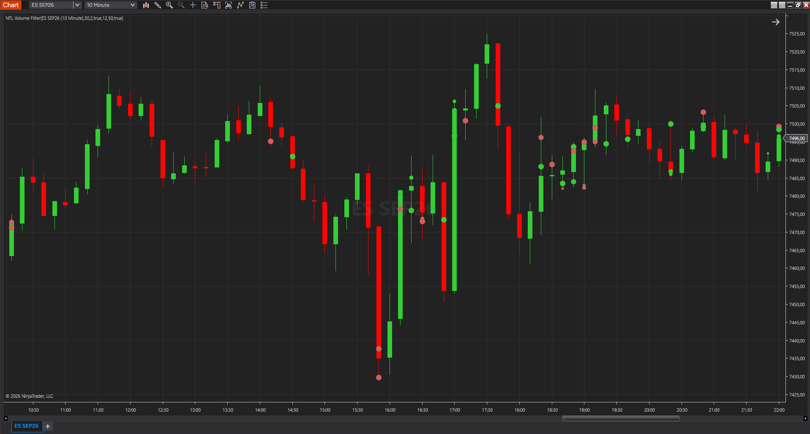
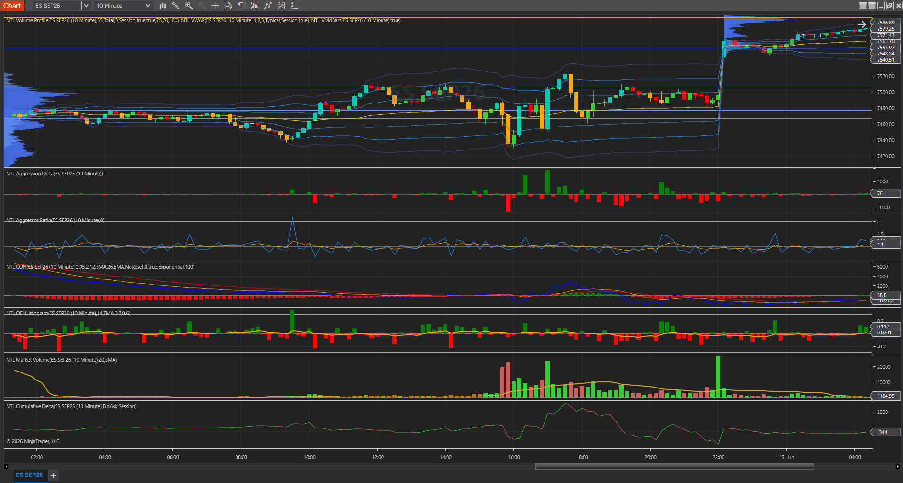

# Linus Indicator Collection

Indicator collections for NinjaTrader 8 and TradingView.

## NinjaTrader 8

Copy the relevant folders under `NT8/` into `Documents\NinjaTrader 8\bin\Custom\`, then compile NinjaScript.

### Indicators

- `NTLAggressionDelta` - per-bar aggressive volume delta.
- `NTLAggressorRatio` - smoothed aggressive buy/sell ratio.
- `NTLBookmap` - historical limit-order-book liquidity heatmap. [WIP]
- `NTLOFI` - order-flow imbalance histogram.
- `NTLCOFI` - cumulative order-flow imbalance.
- `NTLCumulativeDelta` - cumulative bid/ask or uptick/downtick delta.
- `NTLMarketDepth` - current bid/ask depth histogram.
- `NTLMarketVolume` - per-bar market-volume histogram.
- `NTLRangeVolumeProfile` - bars-back range volume profile.
- `NTLTwap` - time-weighted average price.
- `NTLVividBars` - Außenstab, inside-bar, and outside-bar candle coloring.
- `NTLVolumeFilter` - thresholded large-volume trade markers.
- `NTLVolumeProfile` - session volume profile.
- `NTLVwap` - volume-weighted average price.

### Chart styles

- `NTLFootprintChartStyle` - footprint-style price buckets.
- `NTLSimpleHighLowChart` - high/low line chart style.
- `NTLTpoChartStyle` - filled TPO profile chart style. [WIP]
- `NTLTpoLettersChartStyle` - outline-letter TPO profile chart style. [WIP]

### Drawing tools

- `NTLAnchoredVwap` - anchored VWAP with deviation bands.
- `NTLFixedRangeVolumeProfile` - fixed-range volume profile.

## Screenshots

### Bookmap

### Footprint and depth

### TPO

### Volume Filter

### Volume Profile, VWAP, VividBars, and order-flow indicators

## TradingView

TradingView scripts are stored under `TV/`. (probably outdated)

## Requirements

- NinjaTrader 8.
- Tick Replay for tick/order-flow indicators that reconstruct historical trades.
- Real-time bid/ask data for order-flow tools.
- Level II data for depth and Bookmap tools.

## License

See `LICENSE.txt`.

## Disclaimer

These tools are for educational and analysis purposes only. Trading involves risk. Past performance does not guarantee future results.
